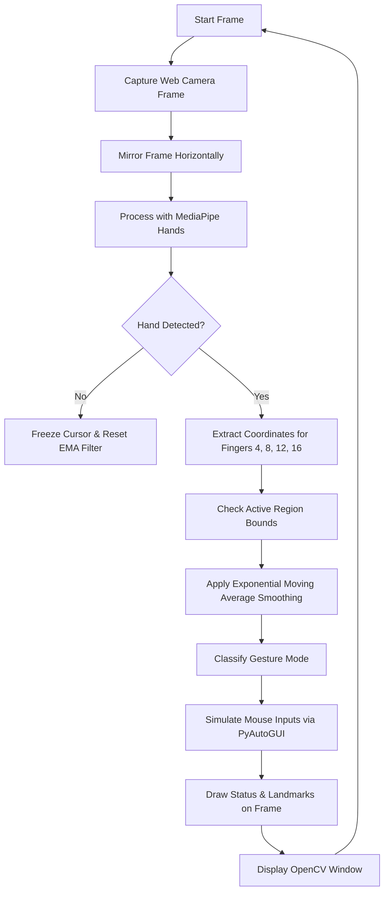

# PRD — Project Requirements Document: Python Virtual Mouse

## 1. Overview
The **Python Virtual Mouse** is an innovative human-computer interaction (HCI) tool that allows users to control their computer mouse cursor and trigger mouse clicks/scrolling hands-free using simple hand gestures captured via a standard computer webcam. It utilizes computer vision to track hand landmarks and translates movement/proximity into standard OS pointer inputs.

### Core Goals:
* **Hands-free Control:** Move cursor, left-click, right-click, and scroll using hand gestures.
* **Low Latency & High Stability:** Smooth cursor movement without hand tremor jitter.
* **Privacy-First:** Process video streams 100% locally with offline execution.
* **Portfolio Showcase:** Create a high-quality, clean codebase suitable for professional demonstration.

---

## 2. System Architecture & Components
The application follows a **Single-Threaded Monolithic Loop** to process video frames synchronously, maximizing simplicity and reliability.

### Components:
1. **Input Processor (OpenCV):** Opens and manages the camera stream (`cv2.VideoCapture`). Flips frames horizontally to match user hand movement directions (mirror layout).
2. **Gesture Tracker (MediaPipe):** Process frames with `mediapipe.solutions.hands`. Locates 21 hand landmarks in 3D space.
3. **Stabilization & Mapper (EMA & Active Region):**
   * **Active Region:** Restricts mouse control tracking to a central box (e.g. 60% of frame center) to allow easier reaching of monitor edges.
   * **EMA Filter:** Smooths coordinates using a weight factor ($\alpha = 0.25$) to minimize hand tremor jitter.
4. **Mouse Controller (PyAutoGUI):** Triggers OS-level movements, clicks, and scrolls.

---

## 3. Gestures & State Machine
The system maps coordinate distances between specific landmarks to simulate mouse actions.

| Mouse Action | Gesture | Technical Condition | PyAutoGUI Action |
|---|---|---|---|
| **Cursor Movement** | Index finger extended | Trace landmark ID 8 (Index Finger Tip) | `pyautogui.moveTo(x, y)` |
| **Left-Click** | Index and Middle finger pinch | Euclidean distance between ID 8 and ID 12 $<$ 30 pixels | `pyautogui.click(button='left')` |
| **Right-Click** | Index and Ring finger pinch | Euclidean distance between ID 8 and ID 16 $<$ 30 pixels | `pyautogui.click(button='right')` |
| **Scrolling** | Index, Middle, and Ring extended | Hand moving vertically relative to previous frames | `pyautogui.scroll(amount)` |

---

## 4. Non-Functional Requirements & Assumptions
* **Local Processing:** 100% offline. No webcam frames are stored, logged, or sent to the cloud.
* **Performance:** Maintains $\ge$ 20–30 FPS on average modern laptop CPU without GPU acceleration.
* **Latency:** End-to-end processing delay (camera capture to mouse movement) under 100ms.
* **Fail-safe:** Pressing key `q` in the OpenCV window closes the application. Moving the cursor manually to any corner of the screen triggers PyAutoGUI's built-in fail-safe and aborts execution.

---

## 5. Error Handling & Edge Cases
* **Tracking Loss:** If the hand leaves the webcam frame, the mouse is frozen. Landings are re-initialized smoothly upon hand re-entry.
* **Multiple Hands:** The application targets a maximum of 1 hand (`max_num_hands=1`) to avoid conflicting cursor inputs.
* **Accidental Click Chatter:** A click event is followed by a $300\text{ ms}$ debounce cooldown period during which subsequent clicks are ignored.

---

## 6. Decision Log
Throughout the brainstorming session, the following design decisions were agreed upon:

| Decision Area | Selected Option | Alternatives Considered | Rationale |
|---|---|---|---|
| **Input Source** | Hand gestures via MediaPipe + OpenCV | Eye/Face tracking, color-object tracking | Highly robust, requires no special hardware/accessories, and has standard Python library support. |
| **Gesture Mapping** | Index tip for motion, finger pinches for clicks | Centroid tracking, finger counts | Pinches are highly intuitive and natural, matching traditional drag/click actions. |
| **Threading Model** | Single-Threaded Monolithic Loop | Decoupled Multi-threading | Adheres to **YAGNI**. Simple to write, read, debug, and explain in a portfolio. |
| **Mouse Sim Library** | PyAutoGUI | `pynput`, native `win32api` | Highly readable, cross-platform standard for Python automation. |
| **Stabilization** | Exponential Moving Average (EMA) | Kalman Filter, simple linear scaling | Excellent noise/tremor rejection, low complexity, and near-zero latency. |

---

## 7. Verification & Calibration Plan
* **Diagnostic Overlay Mode:** Draw visual threshold indicators (bounding boxes, finger line distances, active states) directly on the OpenCV preview window to calibrate tracking parameters for different lighting conditions.
* **Manual Integration Testing:**
  1. Confirm cursor reaches all four corners of the monitor screen comfortably.
  2. Test click accuracy by selecting and dragging folders on the desktop.
  3. Validate scroll functionality in a web browser window.
